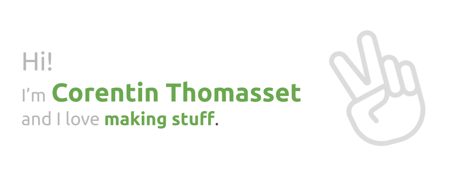

I'm Corentin Thomasset, an engineer in computer science. I have made a lot of divers stuff in my free time and during my scolarship. 

I recently made [it-tools.tech](https://it-tools.tech), a website with handy tools for developers, [cauctus.net](https://cauctus.net) a mobile PWA with useful tools for french improvisational theatre and [inert.now.sh](https://inert.now.sh), a minimalistic tower defense in the browser.

## I made those things
Here is a non-exhaustive list of the main things you can find here, on my github profile.

Webapps:
* **[it-tools.tech](https://it-tools.tech)**: an aggregated set of useful tools that every developer may need once in a while ([sources](https://github.com/CorentinTh/it-tools)).
* **[cauctus.net](https://cauctus.net)**: a mobile PWA with useful tools for improvisational theatre ([sources](https://github.com/CorentinTh/cauctus)).
* **[inert.now.sh](https://inert.now.sh)**: a minimalistic tower defense in the browser entirely in typescript (no deps) ([sources](https://github.com/CorentinTh/inert)).
* **[emotion.ctmsst.vercel.app](https://emotion.ctmsst.vercel.app)**: live facial expression to emoji with your webcam ([sources](https://github.com/CorentinTh/emotion)).

Npm packages:

* **[js-quadtree](https://github.com/CorentinTh/quadtree-js)**: a simple quadtree implementation for javascript and typescript (nodejs or browser).
* **[bame](https://github.com/CorentinTh/bame)**: a cross-plateform tool to rename files batches using regex.
* **[discot](https://github.com/CorentinTh/discot)**: a simple discord bot creation framework.
* **[garant](https://github.com/CorentinTh/garant)**: a simple and lightweight javascript object schema validation library.

Miscellaneous:

* **[satirify-bot](https://github.com/CorentinTh/satirify-bot)**: a twitter bot that mocks tweets when mentionned. Try it: reply "@satirify" to a tweet you want to mock ([demo](https://twitter.com/satirify)). 
* **[robert](https://github.com/CorentinTh/robert)**: A simple and modular discord bot.
* **[iot-potager-demo](https://github.com/CorentinTh/iot-potager-demo)**: POC IoT demo application.
* **[FractalTree](http://divers.corentin-thomasset.fr/fractal-tree/index.html)**: A recursive fractal tree generator ([sources](https://github.com/CorentinTh/FractalTree)).
* **[LangtonsAnt](http://divers.corentin-thomasset.fr/langton-ant/index.html)**: A very simple cellular automaton and Turing machine ([sources](https://github.com/CorentinTh/LangtonsAnt)).
* **[SmartRockets](http://divers.corentin-thomasset.fr/smart-rockets/)**: Genetic Algorithm to find optimal path for rocket to take ([sources](https://github.com/CorentinTh/SmartRockets-GeneticAlgorithm)).

School projects:

* **[all-about-a-place](https://all-about-a-place.corentin-thomasset.fr)**: Location-based information analysis web application ([sources](https://github.com/CorentinTh/all-about-a-place)).
* **[Remote-stove-monitoring](https://sheltered-brook-24116.herokuapp.com/)**: An IoT application and device to monitor your stovetop ([sources](https://github.com/CorentinTh/Remote-stove-monitoring-IoT-backend-and-frontend)).
* **[get-the-dot](https://github.com/CorentinTh/get-the-dot)**: Serverless multiplayer in-browser game.
* **[pld-comp](https://github.com/CorentinTh/pld-comp)**: Bare C to ASM compiler in CPP.
* **[gestif](https://github.com/CorentinTh/gestif)**: XSS fault demo application.
* **[react-if](https://github.com/CorentinTh/react-if)**: Homemade barebone static HTTP server in Java.
* **[express-if](https://github.com/CorentinTh/express-if)**: Barebone live communication chat made in Java.
* **[qualitair](https://github.com/CorentinTh/express-if)**: Air quality report system ever built in C++.

And many other craps...
